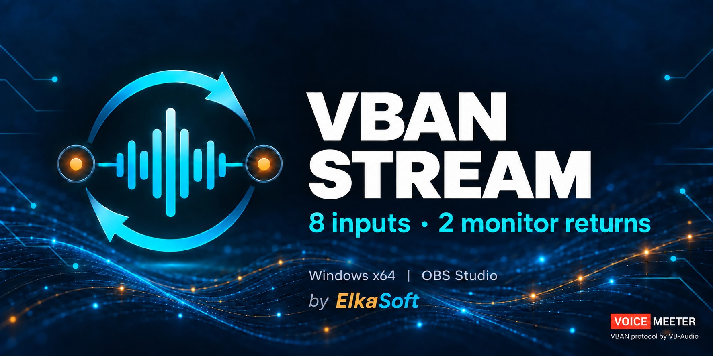
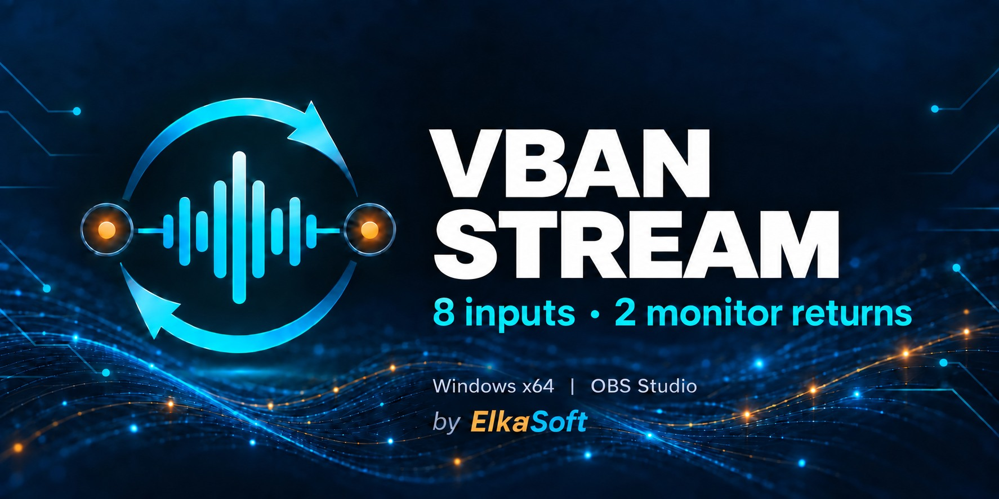
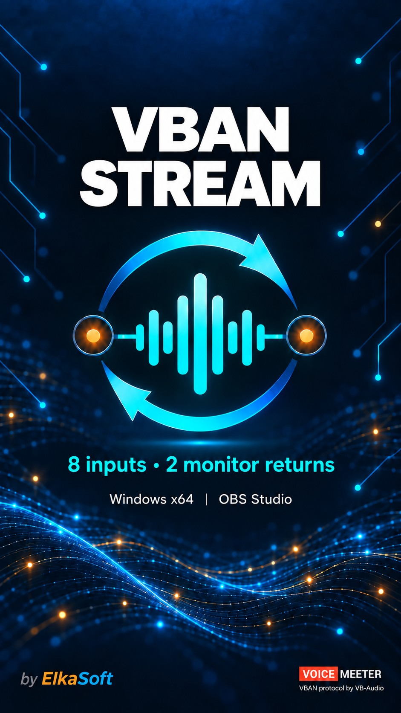
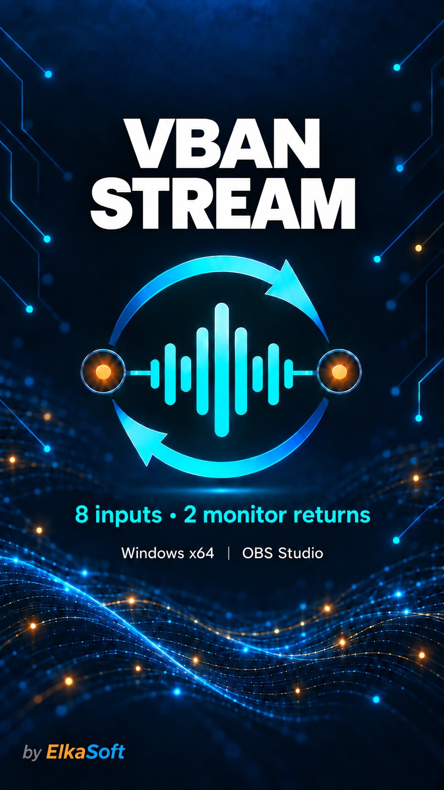

# VBAN Stream artwork

Eight banners for **VBAN Stream by ElkaSoft**, in two matching styles:
**straight circuit lines** and **waves with circuit lines**. Each style has
horizontal and vertical versions, with and without the small VoiceMeeter /
VB-Audio credit.

All versions retain the original cyan/amber logo design, the feature text, and
the compatibility line **Windows x64 | OBS Studio**. The main product title is
**VBAN Stream**. The ElkaSoft attribution appears in every version.

## Downloads

[Download the complete PNG + JPEG ZIP](https://github.com/torment78/obs-vban-audio/releases/download/v0.2.4/VBAN-Stream-artwork.zip).

Every JPEG is **under 1 MB**, exported at quality 92 without resizing.
PNG originals are also provided.

| Design and version | Dimensions | Web / social image | Original image |
| --- | --- | --- | --- |
| Circuits — horizontal — with credit | 1774 × 887 | [JPEG (214.5 KB)](images/social-preview.jpg) | [PNG](images/wide-tagged.png) |
| Circuits — horizontal — without credit | 1774 × 887 | [JPEG (209.2 KB)](images/social-preview-untagged.jpg) | [PNG](images/wide-untagged.png) |
| Circuits — vertical — with credit | 941 × 1672 | [JPEG (226.9 KB)](images/vertical-tagged.jpg) | [PNG](images/vertical-tagged.png) |
| Circuits — vertical — without credit | 941 × 1672 | [JPEG (219.2 KB)](images/vertical-untagged.jpg) | [PNG](images/vertical-untagged.png) |
| Waves — horizontal — with credit | 1774 × 887 | [JPEG (248.9 KB)](images/waves-wide-tagged.jpg) | [PNG](images/waves-wide-tagged.png) |
| Waves — horizontal — without credit | 1774 × 887 | [JPEG (243.0 KB)](images/waves-wide-untagged.jpg) | [PNG](images/waves-wide-untagged.png) |
| Waves — vertical — with credit | 941 × 1672 | [JPEG (258.3 KB)](images/waves-vertical-tagged.jpg) | [PNG](images/waves-vertical-tagged.png) |
| Waves — vertical — without credit | 941 × 1672 | [JPEG (251.8 KB)](images/waves-vertical-untagged.jpg) | [PNG](images/waves-vertical-untagged.png) |

## Straight circuit lines

| Horizontal with credit | Horizontal without credit |
| --- | --- |
|  |  |

| Vertical with credit | Vertical without credit |
| --- | --- |
|  |  |

## Waves with circuit lines

| Horizontal with credit | Horizontal without credit |
| --- | --- |
|  |  |

| Vertical with credit | Vertical without credit |
| --- | --- |
|  |  |

## Website and social use

Use a horizontal JPEG for a desktop website banner or social preview. Use a
vertical JPEG for a portrait website layout or vertical post. Display images at
their natural aspect ratio with `height: auto` so the logo, lettering and
footer credits remain visible.

The README currently uses `docs/images/social-preview.jpg`, the horizontal
circuit design with credit. To switch the README to the waves design, use
`docs/images/waves-wide-tagged.jpg`. The corresponding `untagged` files omit
the VoiceMeeter badge and its caption while retaining **by ElkaSoft**.

GitHub's social-preview image is uploaded separately under
**Settings → Social preview → Edit → Upload an image**. Download whichever
horizontal JPEG you prefer; each is under 1 MB.

These files are ready for the future website. The application icon and Windows
installer icon are separate assets and have not changed.

## Creation

The existing banners were edited with the built-in imagegen tool to replace
only the large **AUDIO** title with **STREAM**. The circuit/waves backgrounds,
logo, feature text, compatibility line and credits retain their existing design.
See the [editing prompts](ARTWORK-PROMPTS.md) and [icon documentation](ICON.md).
