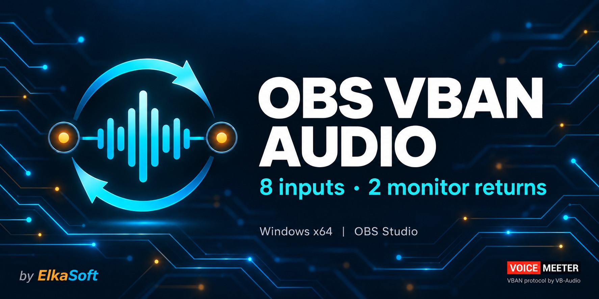
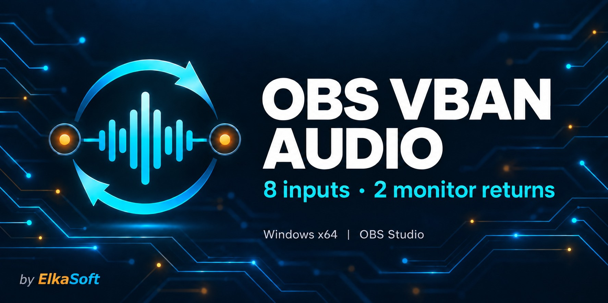
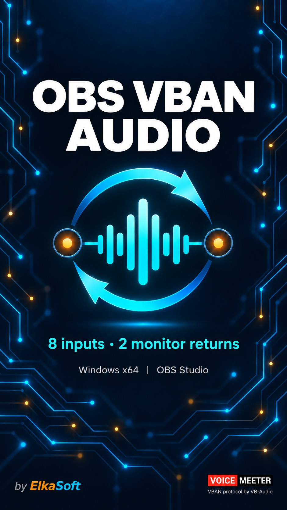
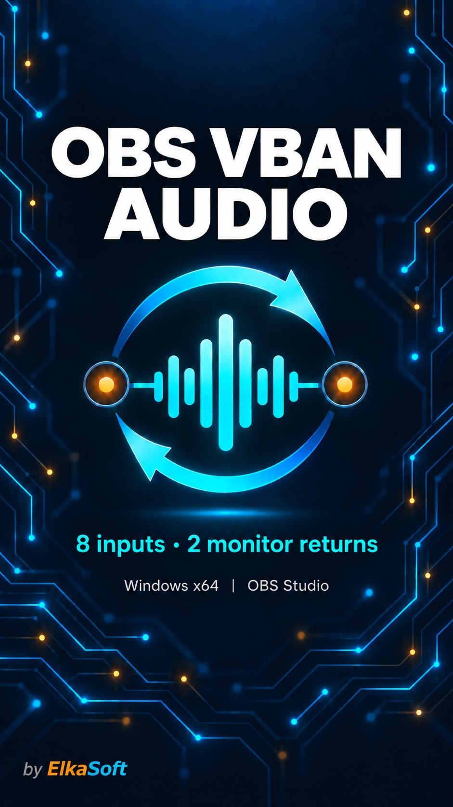

# OBS VBAN Audio artwork

The OBS VBAN Audio banners use layered straight circuit traces, cyan-blue light,
small amber nodes and depth of field on a dark navy background. The original OBS
VBAN Audio logo design and product wording are retained. All versions include
**by ElkaSoft**.

The **with credit** versions include the small VoiceMeeter / VB-Audio credit in
the bottom-right corner. The **without credit** versions omit that badge and its
caption. This choice does not remove the ElkaSoft attribution.

## Downloads

| Version | Dimensions | Web / social image | Original image |
| --- | --- | --- | --- |
| Horizontal with credit | 1774 × 887 | [JPEG (220.9 KB)](images/social-preview.jpg) | [PNG](images/wide-tagged.png) |
| Horizontal without credit | 1774 × 887 | [JPEG (213.8 KB)](images/social-preview-untagged.jpg) | [PNG](images/wide-untagged.png) |
| Vertical with credit | 941 × 1672 | [JPEG (234.4 KB)](images/vertical-tagged.jpg) | [PNG](images/vertical-tagged.png) |
| Vertical without credit | 941 × 1672 | [JPEG (226.5 KB)](images/vertical-untagged.jpg) | [PNG](images/vertical-untagged.png) |

The JPEGs are exported at quality 92 without resizing, all under 1 MB. The PNGs
preserve the generated originals. Dimensions are matched within each pair.

## Horizontal banners

With credit (also used in the README):

Without credit:

## Vertical banners

| With credit | Without credit |
| --- | --- |
|  |  |

## Website and social use

Use the horizontal JPEG as a desktop website banner or social preview. Use the
vertical JPEG for a portrait layout on the future website or for vertical posts.
Display each at its natural aspect ratio with `height: auto` so the logo,
lettering and footer credits stay visible. Avoid cropping the artwork.

The README uses `docs/images/social-preview.jpg`. GitHub's social-preview image
is uploaded separately under **Settings → Social preview → Edit → Upload an
image**; choose the horizontal JPEG you prefer.

The application PNG icon and Windows installer ICO are separate assets and
were not changed by this banner update.

## Creation

Created with the built-in imagegen tool using the existing OBS banner as the
brand reference and the VBAN Plug artwork as a reference for depth and footer
styling. The circuit traces remain straight and angular. See the
[editing prompts](ARTWORK-PROMPTS.md) and [icon documentation](ICON.md).
